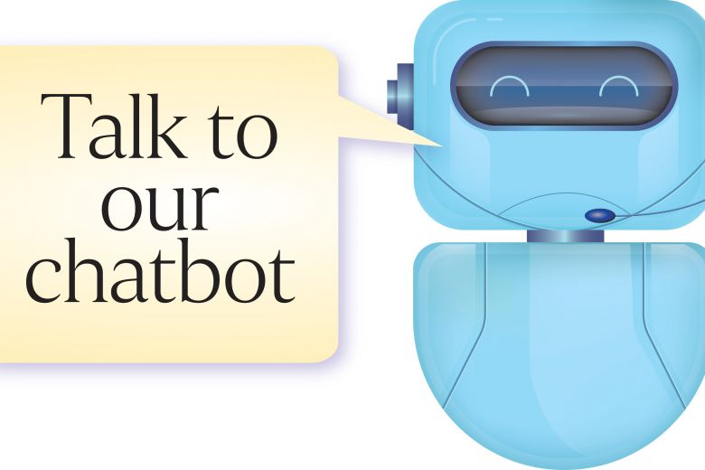

# Titre

## Cartouche d'identification

 - Manifestation : CodeursEnSeine 2018
 - Lieu : Kindarena Rouen
 - Conférence : Fonctionnement d'une IA conversationnelle
 - Horaire de la conférence : 13h25 à 14h
 - Durée de la conférence : 35 minutes
 - Conférencier(s) :
    - Arnold Zephir
        - Twitter : [@cepcap](https://twitter.com/cepcam)
    - FibreTigre
        - Twitter : [@FibreTigre](https://twitter.com/FibreTigre)
 - Audience : + 300 participants
 - Auteur du billet : Chenxin Lu
 - Mots-clés
    - IA conversationnelle
    - Réseau de neurones
    - Deep learning
    - LSTM
    - Variational Auto-Encoder
    - Python
    - Tensorflow
    - Raspberry PI
 - URL de l'illustration : 

## Support
 - Lien vers le support (diapos) présenté en conférence : **N'est pas disponible**
 - Nombre de diapos du support : Entre 15 et 20
 - Plan du support :
    1. Définition d'une IA conversationnelle et projet Yuri
    2. Le rôle des réseaux de neuronnes dans ce type d'IA
    3. Les maths derrière cette IA
    4. Les avantages et les inconvénients d'une IA conversationnelle
    5. Les éléments essentiels pour créer sa propre IA maison
    6. Des ressources pour réaliser une IA

## Résumé
    Les présentateurs ont développé un Chatbot avec ses équipes en utilisant certains techniques dans
    le domaine Intelligence Artificielle. Le processus de développement a été raconté clairement. 
    Tout d’abord, ils ont parlé de l’environnement du développement. Par exemple, il faut avoir les 
    GPUs pour accélérer le calcul de matrices. En plus, pour le lecture de texte, il faut avoir une 
    assez grande taille de mémoire. Ensuite, ils ont utilisé Word2Vec pour obtenir les vecteurs 
    embedding de tous les mots. Nous les considérons comme une représentation de mots. Plus précisément,
    il ont choisi d’utiliser le modèle CBOW quit utilise les représentations de mots dans le context 
    pour obtenir la représentation du mot au centre. Récemment, les réseaux de neurones récurrents 
    sont des architectures typiques pour résoudre ce genre de problèmes de NLP. Dans ce cas-là, 
    les développeurs et les chercheurs d’équipe ont choisi LSTM qui est une variant de RNNs comme
    l’architecture de système dialogue. Avec LSTM, nous pouvons éviter le problème disparition de 
    gradients.  À fin d’améliorer la performance de chatbot développé, ils ont utilisé aussi le GAN 
    qui est dans le cadre d’apprentissage par reinforcement. En bref, avec GAN, ils ont eu deux 
    réseaux de neurones qui se battent entre eux pour chacun devenir plus performant. Dans ce cas-là,
    ils ont pu développer un chatbot qui peut communiquer avec les gens en français. Je pense que 
    leur présentation est claire et ils ont donné beaucoup d’informations pour les auditeurs qui
    s’intéressent dans ce domaine. 

## Architecture et facteur qualité
    En terme de mesures de base au sens de l'ISO9126-4, le coût de ce type de solution est presque 
    null vu que les codes sources sont accéssible sur internet. L'architecture de la solution, 
    dépend fortement de l'environnement du développement ou de déloyment, vu qu'une IA peut être 
    déployé sur Cloud, intégrée dans une solution comme guide ou service d'aide automatique ou sur
    les plateformes comme Facebook, Google ou tout simplement une solution en local en lançant le 
    processus de machine learning sur sa propre machine. Toute architecture peut être testée et 
    modifiée dû à la nature des résultats que nous pouvons obtenir avec les algorithmes de machine 
    learning. Les facteurs de qualité les plus importants que l'on peut déduire de cette technologie
    sont la réutilisabilité, testabilité (vu qu'on peut publier nos application sur des plateformes
    reconnues avec un coût null sous quelques conditions de requêts client), et la portabilité (vu 
    qu'on peut partager la solution en partageons l'architecture et les paramètres du modèle de machine 
    learning associé).
